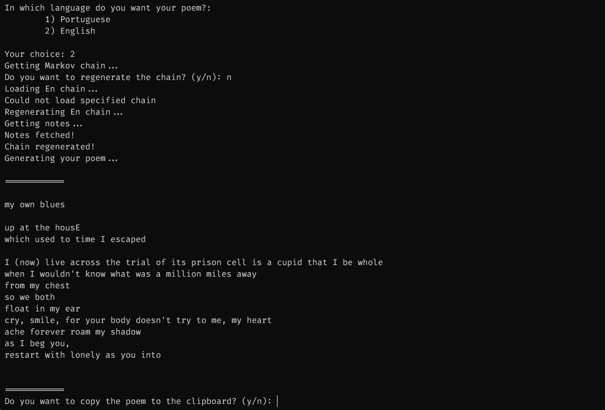

# Poem Generator
Markov Chain text generator to create poems from my exported Google Keep notes

Just a fun project for the purpose of learning Rust and having a laugh

## Features

- Copying poem to clipboard
- Saves and allows loading previously generated chain

## How to run

Only Windows is supported (as it uses [clipboard-win](https://github.com/DoumanAsh/clipboard-win))

The program expects Google Keep notes exported as JSON in a `notes` directory at the same level as `main.rs`.
These are also expected to have the label `poem` as well as a `en` label for English poems and a `pt` label for Portuguese ones.

If the above requirements are met, simply compile and run.
